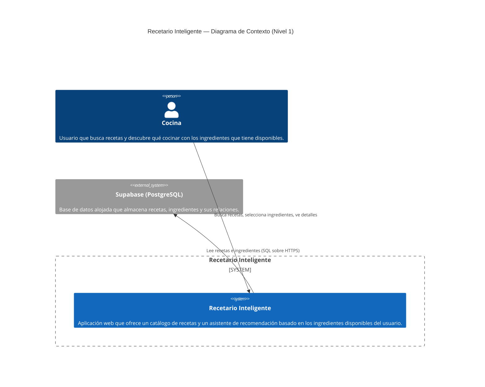

# C4 Nivel 1 — Diagrama de Contexto del Sistema

El diagrama de contexto muestra el sistema como un único bloque y sus interacciones
con los usuarios y sistemas externos.

## Descripción

| Elemento           | Descripción                                                                          |
| ------------------ | ----------------------------------------------------------------------------------- |
| **Cocina** (Persona) | Cualquier persona que entra a la app. No requiere cuenta ni autenticación.           |
| **Recetario Inteligente** (System) | SPA React que renderiza el catálogo, el matcher de ingredientes y el detalle de recetas. |
| **Supabase** (External) | Proveedor de PostgreSQL gestionado. La app se conecta con la anon key a través de la API REST de Supabase. |

## Flujos principales

1. **Explorar catálogo**: el usuario abre la app, ve todas las recetas y puede buscar por texto.
2. **¿Qué cocino hoy?**: el usuario selecciona ingredientes, la app consulta todas las recetas
   de Supabase una sola vez, calcula el match en el navegador y muestra un ranking.
3. **Ver detalle**: al tocar una receta, se muestra la imagen, ingredientes y pasos.
