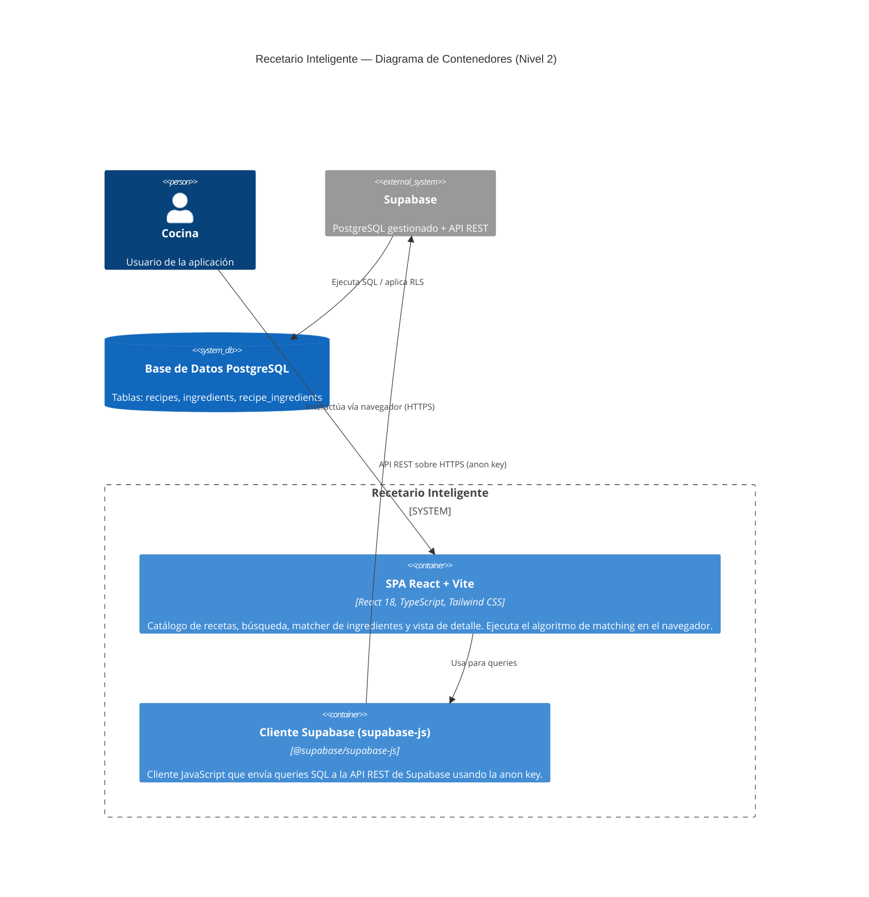
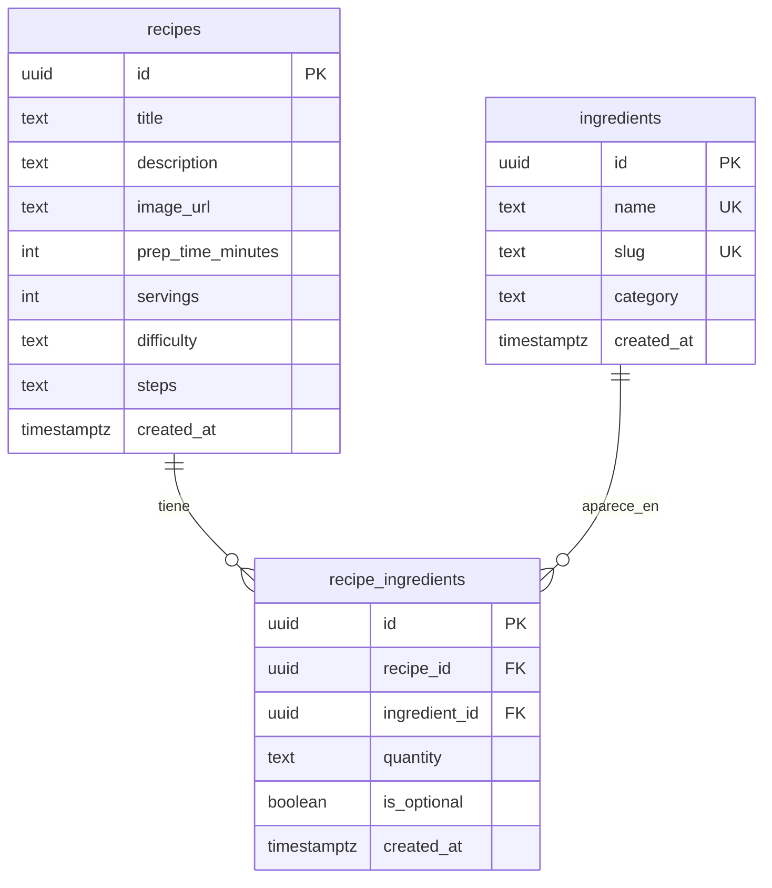
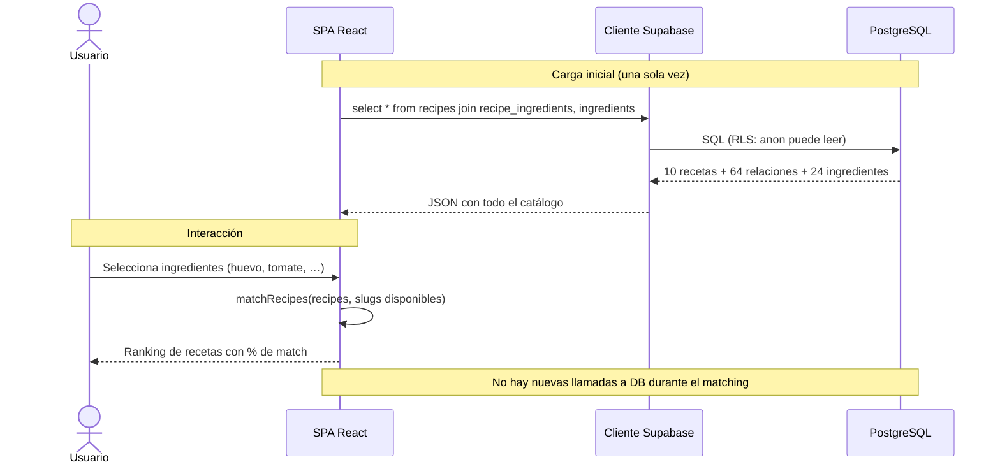

# C4 Nivel 2 — Diagrama de Contenedores

El diagrama de contenedores descompone el sistema en sus contenedores principales
(aplicaciones desplegables independientes) y muestra cómo se comunican.

## Contenedores

| Contenedor              | Tecnología                          | Responsabilidad |
| ----------------------- | ----------------------------------- | --------------- |
| **SPA React + Vite**    | React 18, TypeScript, Tailwind CSS  | Toda la UI: catálogo, búsqueda, matcher, modal de detalle. Descarga todas las recetas e ingredientes en el primer load y ejecuta el matching en el cliente. |
| **Cliente Supabase**    | @supabase/supabase-js               | Capa de acceso a datos. Se inicializa con `VITE_SUPABASE_URL` y `VITE_SUPABASE_ANON_KEY`. Expone métodos `.from().select()`, `.insert()`, etc. |
| **Base de Datos PostgreSQL** | Supabase (PostgreSQL gestionado) | Almacena `recipes`, `ingredients` y `recipe_ingredients`. RLS habilitado con políticas `anon, authenticated`. |

## Modelo de datos

## Flujo de datos en "¿Qué cocino hoy?"

## Seguridad

- **RLS habilitado** en las 3 tablas.
- **Políticas `TO anon, authenticated`** (CRUD abierto) porque la app no tiene login
  y los datos son intencionalmente públicos.
- **Anon key** en el cliente: no hay secretos sensibles expuestos; la anon key está
  diseñada para uso en el navegador.
